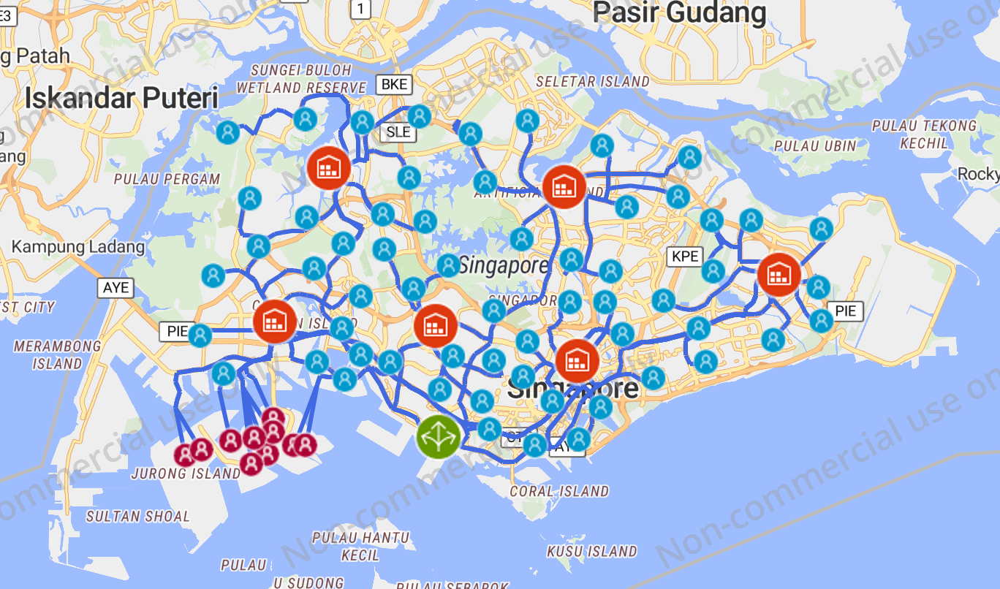

## Use anyLogistixPLE to Simulate Flexible Production Networks

### Introduction to anyLogistixPLE

> anyLogistix™ (ALX™) is software for designing supply chains and managing them with a digital twin. It integrates supply chain design, optimization, and simulation with your operations data so that you can analyze and improve your network end-to-end.
>
> Together, simulation and optimization give you the best set of tools for tackling supply chain challenges, enabling you to gain deep insights into your company’s supply chain, in ways not possible with traditional solutions.

Site: https://www.anylogistix.com/what-is-alx/

### What I have done?

In this course design, I build three different flexible production networks and compare the service level and transportation costs under different demand distributions with anyLgoistixPLE. 

**My experimental results are consistent with the results of two papers on flexible production networks \[1\]\[2\], that is, the long-chain can achieve the same service level as the full-flexibility network when the production network is sysmetrical.** 

Lyu completely compares the average workloads of distribution centers to meet the same service level in the long-chain and the full-flexibility network when the scale of networks, the service level, and the demand standard deviation change[1].

**However, this paper doesn't consider that the demand of one district is actually composed of many demands**, such as demands from schools, communities, etc. They only treat demands in one district as a whole, which doesn't match the actual situation. Based on this assumption, transportation costs will also be difficult to be considered as evaluation criteria for different types of network. **Besides, the customer's demand distribution is only assumed as the Normal Distribution.**

So I made the following improvements.

**(1) Modifications to Network:** We divide the demand of a district into serval demands. These demands are still serviced by certain distribution centers the same as before. 

**(2) Modifications to Demand**: In addition to the normal distribution, we also let the uniform distribution as demand distribution. Besides, we consider the standard deviation of the Normal Distribution and the range of the Uniform Distribution as other influencing factors.

Because some limitations of anyLogistixPLE, we also make other modifications. 

Firstly, we only consider six **distirbution centers(Red icon)**. 

Besides, PLE study version can't control the fleet size of a DC to regulate the distribution capacity, so we use the inventory of a DC to manage its distribution capacity. Every morning the inventory of a DC will be constrained below a certain value by **inventory controllers(Burgundy icon)**, and **the supplier(Green icon)** will deliver a thousand parcels to DCs. 1000 is the distribution capacity of this DC. The DC will deliver parcels to **schools, communities(Blue icon)** by day. 

[1] Lyu G, Cheung W C, Chou M C, et al. Capacity allocation in flexible production networks: Theory and applications[J]. Management Science, 2019, 65(11): 5091-5109.

[2] Jordan, W. C., S. C. Graves. 1995. Principles on the benefits of manufacturing process flexibility Management Science,, 41(4), 577–594.

### How to recurrent my experiments? 

Simply import these xlsx files as SIM and run experiments.

### Experimental Results

Every customer share independent and certain distribution with mean 100 and the distribution capacity of a DC is 1000. Then, we consider the service level and transportation costs as two evaluation criteria. 

Our results match the conclusion in that paper, that is the long-chain can meet the same service level as the full-flexibility network. Besides, our experiments also reveal that the long-chain needs fewer transportation costs than the full-flexibility network.

#### Daily Service Level

**Dedicated Mechanism - N(100,50^2)** 

**Long Chain Mechanism - N(100,50^2)** 

**Pooling Mechanism - N(100,50^2)** 

#### Service Level - Uniform 

|                      | Uniform(15,185)​ | Uniform(25,175)​ | Uniform(50,150)​ |
| -------------------- | --------------- | --------------- | --------------- |
| Dedicated Mechanism  | 90.16%          | 90.43%          | 91.16%          |
| Long-Chain Mechanism | 91.73%          | 91.70%          | 91.56%          |
| Pooling Mechanism    | 91.76%          | 91.76%          | 91.73%          |

#### Service Level - Uniform(15,185)

|                      | Round 1 | Round 2 | Round 3 |
| -------------------- | ------- | ------- | ------- |
| Dedicated Mechanism  | 90.1%   | 90.0%   | 90.4%   |
| Long-Chain Mechanism | 91.6%   | 91.5%   | 92.1%   |
| Pooling Mechanism    | 91.7%   | 91.6%   | 92.0%   |

#### Total Cost - Uniform(15,185)

|                      | Round 1    | Round 2    | Round 3    |
| -------------------- | ---------- | ---------- | ---------- |
| Dedicated Mechanism  | 610535 USD | 610419 USD | 610141 USD |
| Long-Chain Mechanism | 695049 USD | 693667 USD | 697375 USD |
| Pooling Mechanism    | 761869 USD | 760503 USD | 763643 USD |

#### Service Level - Normal

|                      | N(100,25^2) | N(100,40^2) | N(100,50^2) |
| -------------------- | ----------- | ----------- | ----------- |
| Dedicated Mechanism  | 91.33%      | 90.43%      | 89.83%      |
| Long-Chain Mechanism | 91.43%      | 91.33%      | 91.33%      |
| Pooling Mechanism    | 91.43%      | 91.46%      | 91.40%      |

#### Service Level - N(100,50^2)

|                      | Round 1 | Round 2 | Round 3 |
| -------------------- | ------- | ------- | ------- |
| Dedicated Mechanism  | 89.7%   | 89.9%   | 89.9%   |
| Long-Chain Mechanism | 91.2%   | 91.3%   | 91.5%   |
| Pooling Mechanism    | 91.3%   | 91.3%   | 91.6%   |

#### Total Cost - N(100,50^2)

|                      | Round 1    | Round 2    | Round 3    |
| -------------------- | ---------- | ---------- | ---------- |
| Dedicated Mechanism  | 610690 USD | 611121 USD | 610456 USD |
| Long-Chain Mechanism | 694423 USD | 694529 USD | 695722 USD |
| Pooling Mechanism    | 764144 USD | 760989 USD | 765310 USD |

### Final Paper(Chinese)

