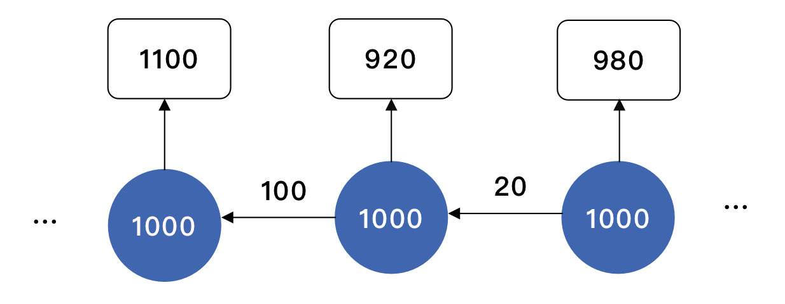

# Use-anyLogistixPLE-to-Simulate-Flexible-Production-Networks

软件：anyLogistixPLE

## 1. 背景介绍

​		在许多的供应链网络中，我们需要用固定的生产能力或配送能力，去满足并不确定的客户需求，并且达到最高的服务水平，这就是**供应链网络能力分配问题（Capacity Allocation）**。

​		以快递配送为例，一个城市有诸多配送中心负责不同的配送区域，每个配送中心的快递员数目是有限的，所以其配送能力也是有限的，但是配送区域内的客户需求却是会有波动的，如果配送能力低于客户需求，便会没法配送，所以需要合理安排配送能力，以满足客户的快递需求。

​		上图是新加坡的快递配送地图，每个黑点代表配送中心，每个色块代表目标的服务区域。如果每个配送中心仅服务于其所在的色块，则属于Dedicated Network；如果**每个配送中心都可以服务与其所在色块相邻的色块，则叫做Flexible Network，即配送中心可以服务不止一个区域**，由于每个配送中心无法服务所有的目标区域，所以其同时属于Partial-Flexibility Network；如果每个配送中心可以服务地图上任意一个区域，则属于Full-Flexibility Network。

​		很明显，在每个区域需要配送的快递不确定的情况下，采用Full-Flexibility Network能实现更高的快递送达率，即每天让其他配送需求比较少的的配送中心出人手，协助配送需求较大的配送中心；而如果采用的是Dedicated Network，则每个区域的需求波动只能够配送中心自己来承担，没法对配送能力进行再分配，其必然面临更高的概率无法送达快递。

​		但是，如果采用Full-Flexibility Network，有些快递员可能需要在整个城市内进行送货了（如下图），其交通成本和时间成本都会比较高，而且会因为道路不熟悉而出现非常多的问题。所以，**能否找到一个Partial-Flexibility Network，即每个配送中心服务特定的几个区域，能够达到Full-Flexibility Network，即每个配送中心服务全部的客户一样的效果呢？这便是Capacity Allocation in Flexible Production Networks，柔性产品网络的配送能力分配问题。**

​		如果直接采用ALX软件内置环节，将所有的客户和配送中心全部导入，并且设置随机需求，软件只能够按照配送能力剩余最多的DCs进行分配，或者按照最近的DCs进行分配，这其实就是Full- Flexibility Network和Dedicated Network，它没有办法找到最合适的配送规则的，所以必须要另寻他路。

​		K-Chain Network是一种常见的柔性网络，其中K代表一个配送中心能够服务的目标客户的数量，在1995年和2019年便有两篇刊登在Management Science上的文章对该问题分别进行了研究。

​		Jordan and Graves于1995年提出了对于随机需求的网络，2-Chain Network能够达到和Full-Flexibility Network达到一样的效果，并且远好于Dedicated Network；Lyu于2019年对该问题提供了新的视角，证明了为了达到某一服务水平，K-Chain Network在K>1时的效果与Full-Flexibility Network在小规模网络中几乎没有差异，并且均远远好好Dedicated Network。

​		**本文将以K-Chain Network为讨论目标，充分利用ALX的SIM模块，以新加坡为例，建立快递配送网络，对当客户的需求是给定的随机分布时，K等于不同值时的服务水平和运输费用进行比较，对论文的结论用实验给予验证。**

## 2. 实验介绍

### 2.1 原理介绍

​		我们已经介绍了K-Chain Network的概念，K表示每个DC服务的Customers个数，在给定所有Customers的需求分布以及需要达到的服务水平后，Lyu提出可以通过以下算法求解最佳的资源配置情况。

​		即每个DC对应K个有固定需求分布如$\mathcal N(100,50)$ 的Customers的情况下，需要达到一定的服务水平（Identical Service Level Requirements），如何指定每个DC对应的K个Customer，能够使得$\sum_{i=0}^n Capacity \; of \; DC_i$的值最小。

​		在设定客户需求均满足独立同分布$\mathcal N(10,3^2)$，目标服务水平为0.99，即每天客户需求有99%的概率可以送到，对应不同的客户数目N（N=4,8,12,16,20）时，K-Chain Network的最低配送能力水平如下图。**我们可以看到，1-Chain Network（K=1）即选择Dedicated Network时，最佳配送分配（Optimal Capacity Profiles）所需要的配送总能力（Total Capacity Level），远远大于K>1的情况，而其实只需要达到K=2，就与Full-Flexibility Network的效果一致。**

### 2.2 实验方法

​		我们将使用ALX的SIM模块先建立有个有固定的配送能力$C$的配送中心DC，每个DC周边有10个需求满足独立同分布的$f(x)$的Customers，建立不同的K-Chain Network（K=1,2,N），比较其在不同的$f(x)$比如正态分布、均匀分布情况下，能够实现的服务水平和所需要的运输费用。

​		1-Chain Network所采用的机制是Dedicated Mechanism，N-Chain Network则是Full-Flexibility Network，2-Chain Network采用的机制又叫Long-Chain Mechanism，如下图。这三种机制比较具有代表性，所以我们将分别对K=1,2,N进行实验。

### 2.2 检验指标

​		主要检验指标有服务水平、运输花费，评价每个机制所能够达到的服务情况和所需要的运输费用，由于软件非商用版不支持车队规模限制，所以不单独研究车辆的负载水平。服务水平分别选择按照Orders和Products来计算，运输费用则考虑从DC运输到Customers的总费用。

​		**理论上对不同需求分布，Long-Chain Mechanism的服务水平与Pooling Mechanism会基本一致，并且会比Dedicated Mechanism的服务水平高出许多，同时运输费用呈现Dedicated < Long-Chain < Pooling。**

## 3. 实验基础配置

### 3.1 实验逻辑

​		为了比较三种网络模型，即Long-chain mechanism、Dedicated mechanism、Pooling mechanism在每个DC运力有限的情况下，能够达到的运力分配效果，我们首先需要建立基础的模型。

​		快递的运送流程是，由客户（Customer）提出需求，中央配送中心（Supplier）通过货车将快递配送到配送中心（DCs），配送中心通过诸多快递员开小车将快递点对点配送到客户手中。由于每个配送中心的快递员数目是有限的，也就限制每个配送中心的配送能力，只需要限制DCs与Customer的配送关系，然后统计客户的需求能否在当天内满足、配送的总费用等参数，就可以量化分析模型的效果了。

​		我们需要采用SIM模块实现上述流程，应用到三种不同模型上，调整需求和配送能力的比例，进行目标参数的统计。

### 3.2 实验修正方案

​		由于在Logistix软件体验版的功能存在部分限制，SIM无法实现车队规模的限制（TO可以实现），也就无法实现DC运输能力的限制，而Sourcing的运输能力限制也只能够在NO中实现，所以无法采用限制运输能力方式来配置运输，而只能够采用限制库存来实现，即库存表示配送能力。

​		为了通过库存策略来限制一个DC每天的配送能力，如果采用Min-Max策略，将Max的值设置为每天的配送能力，则达到配送能力上限后，DC又会重新订货，无法达到限制的目标；如果采用Order on Demand并限制DC的容量，实际测试中不会有货送到DCs；如果采用Regular策略每天重新订货，该订货量为DC每天的配送能力，理论上可行，但是每天会有多余的配送能力留到下一天。

​		假定已经采用了Regular，若通过限制DCs的容量不让多余的配送能力留到下一天，则会出现因为收到货后超出了容量订单被直接取消的情况，即不会有货送到DC，且设置Sales/Production Batch没有效果，但是DCs无法自行清理自己每天的剩余库存，所以，能否通过增加辅助的Customers来清理每天的多余的配送能力？

​		本实验中提出了增加辅助Customers作为Inventory Controllers，在每天送完货之后检查是否有剩余的库存（配送能力），如果有就送到Inventory Controllers，即可清理DCs每天剩余的库存，从而限制其配送能力。下图是经过Inventory Controllers控制后的DCs每天剩余内存。

​		**最终的实验逻辑是， DCs每天订购固定数目的货物，作为当天的配送能力，Customers提出随机需求，由默认的交通工具送货到Customers，如果最后有剩余的库存，则会通过Inventory Controllers控制到一定值以下，如果库存不够则无法服务，该订单Dropped。**

​		新的模型的通过调整库存的逻辑，同样实现了每个配送中心的配送能力的限制，但是该方式会导致配送能力的限制只能够局限于配送数目，而不是配送员的能够走的距离。

### 3.3 配送中心与客户

​		在Lyu的研究中，每个DC都会自己对应的区域，区域内的需求服从一定的分布，但是实际上，以中国大陆为例，快递员是到达小区/学校后，然后统一进行配送，最小的配送单位应该是小区/学校，而不是整个的区域。

​		**所以，我们考虑了更为接近实际的网络，即不是一个区域对应一个需求，而是每个区域内有多个末端配送中心（小区、学校），他们有自己的独立需求，共同组成了该区域内的需求。**以Long-Chain为例，我们绘制了下图，图中的圆形即为末端配送中心。

​		**最终的实现情况是，设置一个Supplier连接，一共设置6个DCs，每个DC所在的区域内设置10个Customer，以模拟小区/学校，并分配到一个Group中，以便于后续设计配送网络，同时在岛上设置了多个Inventory Controllers，连接到DCs，用于控制库存。**

### 3.4 网络实现逻辑

​		SIM模型需要指定固定的DCs，或者在发出订单时在多个DCs中选择库存最大的DC，Pooling和Long Chain两个模型明显需要使用后者。由于如果同时发出Demand，则所有订单都会同时指向当前库存最大的DC，所以需要让需求错峰发出。

​		最完善的方案是为60个Customer全部单独设定的订货时间，在该订货时间时选择库存最大的DCs，但是这将非常复杂，也不便于后续进行离散仿真实验。

​		不过我们可以注意到，如果只考虑10个中的8个Customer，能否实现100%的服务水平呢？事实上是可以的，下图便是采用 $f(x)=Uniform(50,100)$ 且每日订货量为950时的服务水平，只服务八个客户可以满足全部订单。

​		**我们对Group进行改进，从每个区域内的10个客户中抽取出两个，设立为Final Group，对每个Final Group设置独立的配送时间，该配送时间在每个DC配送给了自己区域内前8个Customer后（全部设定为上午2点）**。考虑到装卸时间，每个Customer的请求时间隔了10分钟，即首先Group 1 Final 1寻找对应DC中容量最大的，以此类推。

​		同样采用Long-Chain进行说明，即从每个区域对应的多个末端配送中心中抽取出N个Customer作为Final Group N，其他作为Group N。每个DC最初只服务Group N，上述试验结果表示服务水平在一定范围内为100%，然后Final Group中的末端配送中心由两个DC服务，从中选择库存更大的那一个服务即可。**两图能够实现的效果基本上是一致的**

​		最终，我们在ALX中的设置如下：

| Customers       | Times    | End Time |
| --------------- | -------- | -------- |
| Group 1 Final 1 | 08:10 AM | 11:10 AM |
| Group 1 Final 2 | 08:20 AM | 11:20 AM |
| Group 2 Final 1 | 08:30 AM | 11:30 AM |
| Group 2 Final 2 | 08:40 AM | 11:40 AM |
| Group 3 Final 1 | 08:50 AM | 11:50 AM |
| Group 3 Final 2 | 09:00 AM | 12:00 AM |
| Group 4 Final 1 | 09:10 AM | 12:10 AM |
| Group 5 Final 1 | 09:20 AM | 12:20 AM |
| Group 5 Final 2 | 09:30 AM | 12:30 AM |
| Group 6 Final 1 | 09:40 AM | 12:40 AM |
| Group 6 Final 2 | 09:50 AM | 12:50 AM |
| 其他            | 02:00 AM | 08:00 AM |

​		**Long-Chain Mechanism****的Group N中8个Customer分别对应具体的DC N，采用固定的解的策略，剩余Final Group N则对应DC N-1、DC N、DC N+1三个配送中心，组成一条链。**先统一配送Group N中的Customers，然后逐一配送Final Group中的Customers。

​		**Dedicated Mechanism的Group N和Final Group N均对应且仅对应DC N**，所以每个区域中对应的10个Customers只会由对应的DC配送。

​		**Pooling Mechanism的Group N对应DC N，Final Group N对应DCs**，即最后两个客户会优先由库存最多的DC配送。

**Long-Chain Mechanism**

**Dedicated Mechanism**

**Pooling Mechanism**

### 3.5 需求与库存

​		上一节中我们提到了将最后两个Customer错峰发出请求，这一节我们讨论如何管理库存和需求。

​		**库存方面**：每天早上一点钟统一检查库存，订购一定数目的快递，也就是当日的配送的最大的快递数目，由Supplier配送过来，由于新加坡面积较小，且不存在车队规模限制，货物将在一小时内送到。

​		**需求方面**：每天早上2点Group N Customer发出周期性请求，其符合目标的分布函数$f(x)$，Lead Time设定为6小时，由于新加坡较小，只要有足够库存，六小时肯定能够送到货；每天上午8点开始分配剩余的快递，按照上一节介绍的时间安排，发出固定的需求，货物将在三小时内配送到位，所以Lead Time设置为3小时。

​		所有的Backorder Policy全部设置为Not allowed，即如果库存无法满足需求，该订单将会被放弃，将用于服务水平的计算。

### 3.6 库存控制器

​		库存控制器即10个额外的Customer，在每天下午7:00后发出请求，每次请求50个，采用Most Inventory策略，即选择库存最多的DC发货，实验结果显示该策略最终可以控制所有的DC的剩余库存均在50以内。

​		由于Most Inventory的策略如果同时发出，将会请求同一个DC，所有Controller的Demand的请求也是错峰发出，Lead Time设置为3小时，超出时间全部放弃订单，即没有DC能够满足订单需求，DCs的库存全部在50以内。

| Customers               | Times    | End Time |
| ----------------------- | -------- | -------- |
| Inventory Controller 1  | 07:10 PM | 10:10 PM |
| Inventory Controller 2  | 07:20 PM | 10:20 PM |
| Inventory Controller 3  | 07:30 PM | 10:30 PM |
| Inventory Controller 4  | 07:40 PM | 10:40 PM |
| Inventory Controller 5  | 07:50 PM | 10:50 PM |
| Inventory Controller 6  | 08:00 PM | 11:00 PM |
| Inventory Controller 7  | 08:10 PM | 11:10 PM |
| Inventory Controller 8  | 08:20 PM | 11:20 PM |
| Inventory Controller 9  | 08:30 PM | 11:30 PM |
| Inventory Controller 10 | 08:40 PM | 11:40 PM |

### 3.7 其他设置

设置运输的费用和销售的Batch。

## 4. 实验过程

### 4.1 概述

​		本实验中，我们已经确定了所有的DC和Customers的数目和位置，同时通过错峰请求实现了基本同时对Customer与DC进行动态安排，以达到大的服务水平。

​		而我们需要对比Long-Chain Mechanism、Pooling Mechanism、Dedicated Mechanism三种机制在相同的客户需求分布、供货的情况下，各自能够达到的服务水平，同时比较其运输费用情况，所以，**我们将客户的需求分布函数以及客户需求分布的期望值与供货能力的比值作为主要的调节参数**，**进行离散仿真实验**。

​		大部分的参数不会影响实验结果，比如交通工具、运送货物情况等，所以我们不需要进行修改，直接按照默认设置，进行一年期的实验即可。

### 4.2 离散仿真比较

​		以下是离散仿真的参数选择范围，由于篇幅限制，主要考虑分布函数的影响，不考虑供给能力的变化。

|          | Customers需求分布函数                                        | DC的供给能力 | 时间种子 |
| -------- | ------------------------------------------------------------ | ------------ | -------- |
| 具体选择 | $\left\{ \mathcal N(100,25^2),\mathcal N(100,40^2),\mathcal N(100,50^2),\\Uniform(50,150), Uniform(25,175),Uniform(15,185) \right\}$ | {950}        | {0,1,2}  |

每个DC共对应10个Customers，为了使得试验结果中的服务水平参数明显，供给能力设置的略小于需求的期望值，正态分布和均匀分布的期望值均为$\mu=100$，需求设置得比100*10=1000要稍小，这里我们统一设置为950。

### 4.3 统计函数配置

  **服务水平**：分别对Dayily和Accumulate进行比较，查看每个DC能够到的Service Level by Order.

  **运输费用**：限制对象为6个DC，限制目的地Group Customer或者Final Customer，排除Supplier到DC以及DC到Controllers的运输费用。

## 5.实验结果

### 5.1 均匀分布

我们对几个均匀分布进行重复试验，试验结果如下。**当需求的水平的变化范围较小时，即取$Uniform(50,150)$，三种模式的差异并不大**，均为91.5%上下；**随着其随着变化范围的增加，Long-Chain Mechanism与Pooling Mechanism的服务水平几乎没有下降（出现上升应该是由于试验次数不够），Dedicated Mechanism的服务水平逐渐下降**，并与前两种机制的服务水平差距逐渐拉大。

|                      | $Unifomr(15,185)$    | $Unifomr(25,175)$    | $Unifomr(50,150)$    |
| -------------------- | ---------- | ---------- | ---------- |
| Dedicated Mechanism  | 90.16% |	90.43% |	91.16% |
| Long-Chain Mechanism | 91.73% |	91.70% |	91.56% |
| Pooling Mechanism    | 91.76% |	91.76% |	91.73% |

**不同需求分布服务水平统计**

该试验结果基本符合预期，即服务水平Pooling Mechanism  Long-Chain Mechanism >> Dedicated Mechanism。我们对$Uniform(15,185)$的试验结果进行进一步分析，每轮的具体的服务水平变化以及服务水平和交通费用如下。

**服务水平统计**

|                      | Round 1    | Round 2    | Round 3    |
| -------------------- | ---------- | ---------- | ---------- |
| Dedicated Mechanism  | 610535 USD | 610419 USD | 610141 USD |
| Long-Chain Mechanism | 695049 USD | 693667 USD | 697375 USD |
| Pooling Mechanism    | 761869 USD | 760503 USD | 763643 USD |

**交通费用统**

**Dedicated Mechanism**

**Long Chain Mechanism**

**Pooling Mechanism**

**服务水平**：Pooling Mechanism $\approx$ Long-Chain Mechanism >> Dedicated Mechanism，且Pooling Mechanism与Long-Chain几乎无差异。

**交通费用**：Pooling Mechanism < Long-Chain Mechanism < Dedicated Mechanism，且Pooling与Long-Chain和Long-Chain与Dedicated的差异基本持平。

### 5.2 正态分布

我们对三种正态分布进行分析，试验结果与均匀分布类似，随着随机数生成的范围扩大，

|                      | $\mathcal N(100,25^2)$ | $\mathcal N(100,40^2)$ | $\mathcal N(100,50^2)$ |
| -------------------- | ---------------------- | ---------------------- | ---------------------- |
| Dedicated Mechanism  | 91.33%                 | 90.43%                 | 89.83%                 |
| Long-Chain Mechanism | 91.43%                 | 91.33%                 | 91.33%                 |
| Pooling Mechanism    | 91.43%                 | 91.46%                 | 91.40%                 |

**不同需求分布服务水平统计**

我们选择实现效果比较好的需求分布$\mathcal N(100,50^2)$进一步分析，服务水平的实时统计以及服务水平和花费的数据如下。

|                      | Round 1 | Round 2 | Round 3 |
| -------------------- | ------- | ------- | ------- |
| Dedicated Mechanism  | 89.7%   | 89.9%   | 89.9%   |
| Long-Chain Mechanism | 91.2%   | 91.3%   | 91.5%   |
| Pooling Mechanism    | 91.3%   | 91.3%   | 91.6%   |

$\mathcal N(100,50^2)$**时服务水平统计**

|                      | Round 1    | Round 2    | Round 3    |
| -------------------- | ---------- | ---------- | ---------- |
| Dedicated Mechanism  | 610690 USD | 611121 USD | 610456 USD |
| Long-Chain Mechanism | 694423 USD | 694529 USD | 695722 USD |
| Pooling Mechanism    | 764144 USD | 760989 USD | 765310 USD |

$\mathcal N(100,50^2)$**时交通费用统计**

$\mathcal N(100,50^2)$**Dedicated Mechanism**

$\mathcal N(100,50^2)$**Long Chain Mechanism**

$\mathcal N(100,50^2)$**Pooling Mechanism**

**查看综合统计结果，可以得到一样的结论。**

**服务水平**：Pooling Mechanism $\approx$ Long-Chain Mechanism >> Dedicated Mechanism，且Pooling Mechanism与Long-Chain几乎无差异。

**交通费用**：Pooling Mechanism < Long-Chain Mechanism < Dedicated Mechanism，且Pooling与Long-Chain和Long-Chain与Dedicated的差异基本持平。

### 5.3 结果分析

​		我们可以看到，不管是采用正态分布还是采用均匀分布，服务水平基本上满足Pooling $\ge$ Long-Chain $>$Dedicated。

​		在正态分布和均匀分布需求的变化范围较小时，三种分配机制的差异并不明显，随着需求变化范围的扩大（方差增加），Pooling与Long-Chain两种机制几乎没有变化，但是Dedicated却开始下降，该结果符合论文的实验预期，即Long-Chain于Pooling的服务水平类似并高于Dedicated。

​		原因非常简单，**由于每个DC的供给能力有限，每个区域内的十个Customers的需求变化越大，如果只能特定的一个DC供给，服务水平就会下降，但是如果由全部的DC共同承当，就能够基本抵消需求的波动，链式的供应能力可以在链上进行有限分配**。（在此没有做将6个DC分成两个链的实验）

​		我们也可以用一个单向链来解释，第一个DC供应能力不足，可以由第二个DC供应，但是也导致了第二个DC不足，由第三个DC补充供应能力，但是实际的情况是双向的，效果会比单向更好。偶尔也可能出现无法满足需求，导致无法传导供应能力，所以一般来说Long-Chain的服务水平会Pooling更低。

​		实验结果也展示了配送费用方面，Pooling的配送费用比Long-Chain高出很多，因为Pooling是从全局调配供应能力的，而ALX不支持选择最近的有库存的DC，所以很多情况下并不是选择最优的DC，导致配送费用高很多。

​		但是不管怎么样，Long-Chain是比Pooling更好的，除了配送费用有优势方面，还需要考虑到快递员对交通的熟悉程序有限，Long-Chain只服务于三个区域，所以Long-Chain模式更加符合实际。

​		**结论：我们实验可以佐证，在确定的客户需求和配送能力的情况下，Long-Chain Mechanism与Pooling Mechanism的确可以达到相同的服务水平，且其服务水平在需求变大较大时，均远高于Dedicated Mechanism，并且Long-Chain Mechanism的配送成本相对于Pooling Mechanism会更低。**

## 6.总结

​		缺点：(1) 虽然考虑了均匀分布和进行了重复实验，但是离散仿真的完整性仍然不足（若按照论文研究的标准）(2) 实验与实际情况仍有偏差，比如动态安排配送目的地中简化了该问题 (3) 由于软件限制，许多模块做了让步。

​		**创新点：(1)考虑了成本情况，这是MS上两篇文章均没有考虑到的 (2)考虑实际的末端配送点，比MS上文章更加接近实际 (3)添加了均匀分布作为目标分布 (4)基于ALX原有功能，进行了创新性的调整，实现了快递配送的模拟。**

​		本实验通过实际的实验，证明了在配送能力为确定值时，需求不管是呈现正态分布还是均匀分布，Long-Chain Mechanism与Pooling Mechanism的确能够达到相似的服务水平，在比需求分布的变化程度（方差）超过一定值时，他们的服务水平也会远远好于Dedicated Mechanism；同时，Long-Chain Mechanism的交通费用远低于Pooling Mechanism，也跟更加符合快递配送的实际。

​		**结论：在考虑能力分配时，的确应该优先考虑Long-Chain Mechanism。**

 

## 参考文献

[1] Lyu G, Cheung W C, Chou M C, et al. Capacity allocation in flexible production networks: Theory and applications[J]. Management Science, 2019, 65(11): 5091-5109.

[2] Wang Y, Zhang D, Liu Q, et al. Towards enhancing the last-mile delivery: An effective crowd-tasking model with scalable solutions[J]. Transportation Research Part E: Logistics and Transportation Review, 2016, 93: 279-293.

[3] Jordan, W. C., S. C. Graves. 1995. Principles on the benefits of manufacturing process flexibility Management Science,, 41(4), 577–594. 

[4] Smirnov A, Levashova T, Shilov N. Knowledge sharing in flexible production networks: a context-based approach[J]. International journal of automotive technology and management, 2009, 9(1): 87-109.

[5] Glasmeier A. Technological discontinuities and flexible production networks: The case of Switzerland and the world watch industry[J]. Research policy, 1991, 20(5): 469-485.